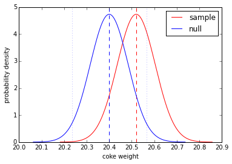
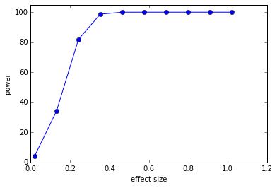
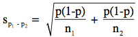
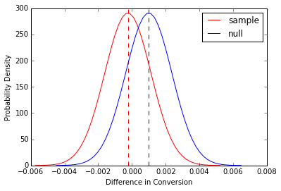

Include your answers in `individual.py`

##Part 0: Introduction to Power

Statistical power is a measure of ability of detecting an effect/difference when an effect/difference actually exists. It is particularly useful when you cannot reject the null hypothesis of your test and would like to know what is the probability that your test would have been significant given there is actually an effect/difference.

<br>

Suppose you are interested in testing if, on average, a bottle of coke weighs 20.4 ounces. You have collected a
simple random sample of 130 bottles of coke and weighed them.

1. Load the data in with `numpy.loadtxt('data/coke_weights.txt')`.

2. State your null and alternative hypothesis.

3. Compute the mean and standard error of the sample. State why you are able to apply the Central
   Limit Theorem (CLT) here to approximate the sampling distribution to be normal.

4. Use `scipy` to make a random variable of the sampling distribution of the mean. Plot the PDF over `+/- 4
   standard error`. Make another random variable of the sampling distribution formulated by the
   null hypothesis (null distribution). Use the standard error from the sample as an estimator
   for the standard error of the null distribution. Plot the PDF of the second random variable on the
   same plot.

5. Plot vertical lines to indicate the bounds for rejecting the null hypothesis assuming a
   significance level of 0.05. Based on the bounds for rejecting the null, what conclusion
   can we draw based on the sample of 130 bottles of coke?

   

6. Build a 95% confidence interval based on the sample data. Does your interval suggest that the weight of a bottle of coke is different than 20.4 ounces? Explain what a false negative is in the context of this problem.

7. Under the null specified in part 2, using a 5% type I error rate, and considering the true mean being equal to the one found in our sample; compute the power of the test. Explain what power means in the context of this problem.

<br>

##Part 1: Factors that Influence Power of a Test

Statistical power is affected by a number of factors, including the **sample size**, the **effect size (difference
between the true value of the mean and the hypothesized parameter value formulated under the null)**, the amount of **variance** and the **significance level**. Here we are going to explore the effect of these factors on power.

<br>

1. Write a function `explore_power` that includes all the steps in `Part 0`. The input will be the mean value under the null hypothesis (i.e. `20.4` ounce as we have specified above) and the output is the power. 

   Assume now the null hypothesis is that a bottle of coke weights `20.2` ounces. Run  `explore_power()` with the new null hypothesis. Did the power increase or decrease? Explain your observation.

2. Make a plot of **effect size (x)** against **power (y)**. The effect size is the absolute difference between the value under the null hypothesis and the true value of the mean.  Consider the true value of the mean is what we find in our sample (i.e. `effect size = 20.519 - 20.4` if the null is `20.4`).

   

3. Without writing any code, explain why the standard error decreases as the sample size increases. Furthermore, extrapolate and explain the relationship between **sample size** and **power**. Verify your result by computing power on a larger dataset with 1000 data points (`numpy.loadtxt('data/coke_weights_1000.txt')`). Is the power higher or lower with a larger sample size given the effect size and significance level held constant?

4. How does the power change if the significance level is increased from `0.05` to `0.1`. Explain your observation in terms of the increase/decrease probability of false positive/false negative. Plot **significance level (x)** (over a range of `0.01 - 0.3`) against **power (y)**.

<br>

##Part 2: Power Calculations for A/B testing  

One common problem in A/B testing is to decide when to stop the experiment. Power calculations are very useful in determining the required minimum sample size necessary to reach a certain power (usually 80%), given an effect size and a significance level.

A powerful test would ensure we are able to detect differences in conversion the majority of the time given the difference in fact exists. To gain insights about the effect size, a small-scale pilot experiment is usually launched. The minimum sample size is computed. Subsequently, a full-scale experiment is run until the minimum sample size is reached.

<br>

Continuing from yesterday's [Etsy case study](https://github.com/zipfian/ab-testing/blob/master/pair.md), get the
conversion data for the new and old landing pages with the code below.

```python
data = pd.read_csv('data/experiment.csv')
old_data = data[data['landing_page'] == 'old_page']['converted']
new_data = data[data['landing_page'] == 'new_page']['converted']
```

<br>

Historically, the old page has a conversion of 10% and we wish to test if the new page provides a 0.1% increase
(1% lift) in conversion. Recall the null and alternative hypotheses below:

```
# Set X as a random variable which is the (new conversion - old conversion)
X ~ p_new - p_old

H0: \pi_new - \pi_old = 0.001
H1: \pi_new - \pi_old > 0.001
```

<br>

###Part 2.1: Computing Power for Pilot Sample

In this part, we are going to compute statistical power for the pilot experiment given the null hypothesis.

1. By the CLT, we can approximate the sampling distribution of proportions (`p_new, p_old`) to be normal (since proportions are effectively a mean of 0's and 1's). We can further assume the sampling distribution of `p_new - p_old` to be normal.

   Compute `p_new - p_old` and the standard error from the sample and define a normal distribution random variable. Plot the PDF of the random variable as you have done previously.

   **Hint: Standard Error for difference of proportions**

   


   - `p` is a weighted average of the `p1` and `p2`
   - `n1` is the number of subjects sampled from the first population
   - `n2` is the number of subjects sampled from the second population


2. Define another random variable for the null distribution and plot the PDF of the random variable. Add
   a vertical line on the plot to indicate the bound for rejecting the null hypothesis given a significance
   level of 5% (not shown in plot below).

   

3. Compute the power of the test given the null hypothesis if the true value of the mean is what is found from the sample. If the result seems strange to you, move onto `5.`.

4. What problem do you spot here with the plot from `2.`? Is increasing the sample size going to increase power?
   If the effect size in the pilot is indeed representative of the ground truth, will the test ever be               statistically significant? Explain your answer and suggest what the next steps should be.

5. Assume after reviewing the data, Etsy decided the pilot is a plausible enough representation of the company's daily traffic. As a result, Esty decided on a two-tailed test instead, which is as follows:

   ```
   X ~ p_new - p_old

   H0: \pi_new - \pi_old  = 0.001
   H1: \pi_new - \pi_old != 0.001
   ```

   **Recompute the power of the test**


###Part 2.2: Computing Minimum Sample Size

Assume Etsy is staying with the two-tailed test described in `Part 2.1: 5`. A decision then would have to be
made about how long the test is running.

The minimum sample size is calculated by following the exact same process with calculating power, except power is a given (80%) and sample size is omitted.

1. Write a function `calc_min_sample_size` that would take
   - 2 lists/arrays of data (i.e. new page converts and old page converts)
   - Significance Level (Default: 0.05)
   - One-tailed to two-tailed test
   - Effect Size
   - Power (Default: 0.8)

   And return the minimum sample size required (rounded up to the nearest whole number).
