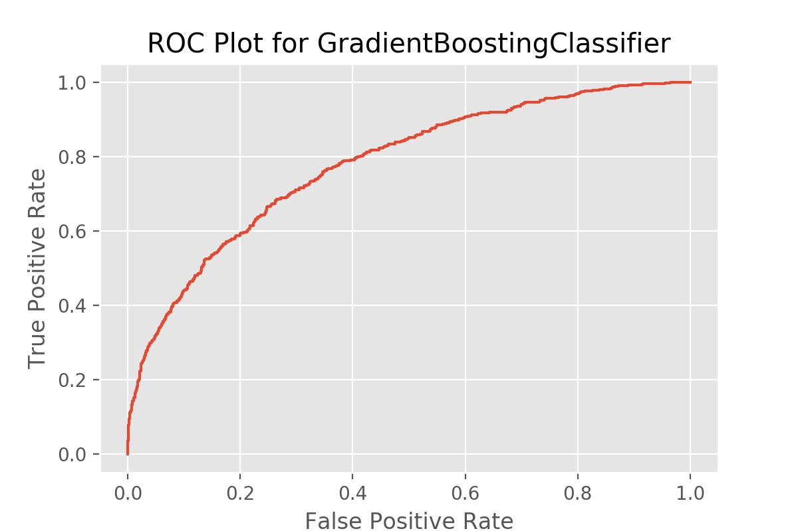
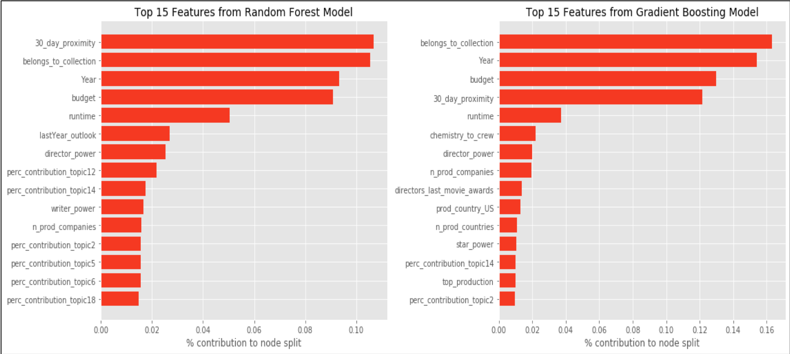

# 
## Predicting the Success of a Film Using Natural Language Processing (LDA) and Machine Learning

Hollywood is a ruthless business. Achieving success in show biz means fame, fortune, legacy and adoration. But the stakes are high: 
70% of movies that are made have a negative ROI.. Meaning they lose money for the original production studios. Many producers, writers and actors struggle their entire life in vain for just a small glimmer of the limelight.

**What if you could know with more certainty if a movie has a real shot at success before your money is sunk?**

Lot's of people complain that "movies these days are so formuliac".. Well, there may be some truth to that statement. I've set out to create a machine learning classification system that --- when trained with over 7000+ films throughout history --- gets to the bottom of what this formula is.

*For more information on the project, use case and solution architecture, see [my powerpoint](https://github.com/MaxBamberger/DataScienceProjects/blob/master/film-success-classifier/movie_prediction_model-compressedv2.pdf)*

## Try it out! 
You can try [making a prediction](http://input.cinemalpha.com) on a future movie with the web-app - a UI I put together that uses my predict.py engine to make a prediction on customized data.. 
(Put together for demonstration purposes only. I never claimed to be a great web-developer :))

## About the model itself:
Success is defined as a movie that has a positive profit. Profit is calculated as revenue minus 3x the production budget, an industry 'rule of thumb' to accomodate for distribution costs that come off of the top line: 

```Profit = Revenue - (3 * Production_Budget)```

The main success/failure and predicted probability is performed with a Gradient Boosting algorithm, however textual data such as the plot synopsis, tagline etc. is fed to a Latent Drichlet Allocation for Topic Modeling. Typically the best Coherence value for training data of this size is found with just 11 topics. These topics (and each movie's % contribution to them) are fed back into the Boosting classifier as new features. The General pipeline is as follows:
 - 1000's of records of film metadata is ingested through two public APIs (see below). data is cleaned and success labels are applied
 - New features are engineered such as:
    - Director/Writer/Actor popularity
    - Max Acedemy Performance of each cast-member's last movie
    - Studio Performance
    - Historical Chemistry between actors and directors
    - Release proximity to other film's releases
    - and many more!
 - Plot Synopsis text: Latent Drichlet Allocation (Topic Modeling)
 - Main classifier algorithm: GradientBoosting Classifier, though XGBoost and Random Forest are yield comparable results 


### Model scoring:
 - Receiver Operating Characteristic (ROC) curve. As you can see is decently accurate but there is room for improvement
 (*note:* when scoring the model, please make sure to use a TimeSeries split after sorting by `release_date`. as cross validation without respect to temporal dependencies will cause data leakage and falsely inflated scores): 

 - Cross-validated confusion Matrix (how often false-positives / false-negatives vs. correct predictions occur) :
 


 - Accuracy Score: 0.72
 - ROC AUC ~ 0.7789 
 - Recall mean ~ 0.631 
 - Precision Mean ~ 0.590

### Feauture importance:

### Where does the data come from?
 - Data is ingested through two APIs:
    - [Open Movie Database (OMDB) API](http://omdbapi.com/) Contains useful metadata about the movie including directors, actors, writers and awards
    - [The Movie Database (TMBD) API](https://www.themoviedb.org/documentation/api) Contains some useful fields including budget and revenue information
 - Any titles not of the category 'movie', or have missing revenue/budget information are scrapped
 - I've created some handy tools for requesting the APIs and ingesting the data (more to come)
